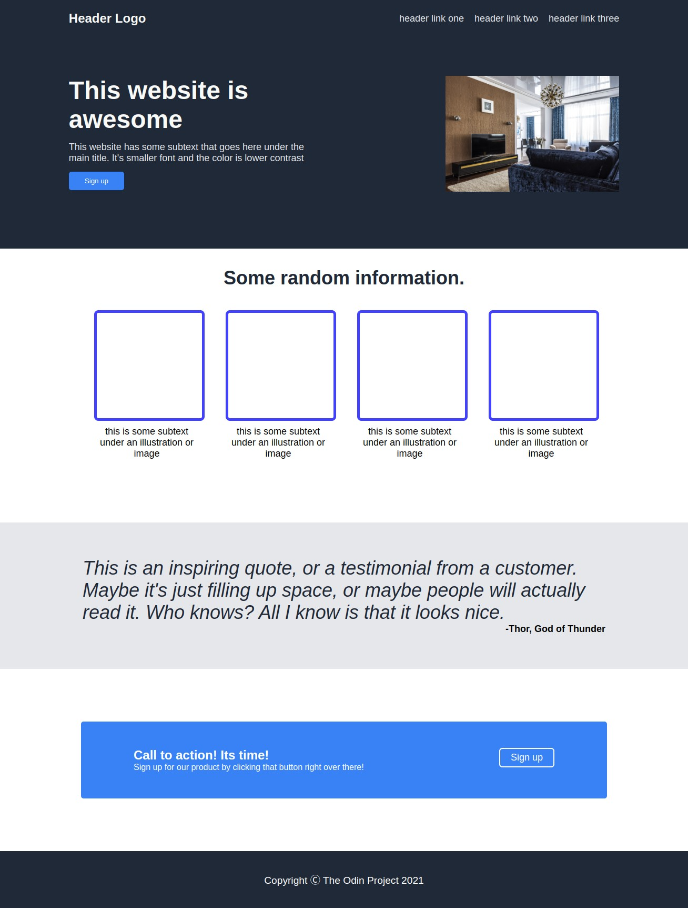

# Introduction
Hi! I am Kshitij Rajgude. I am making this website as a practice for my css and html skills. This website is actually one of the projects that I need to complete go on to the next chapter(which is JavaScript). In this project I use flexbox, html, basic css, etc.

To make this, Landing page we were provided with two picture, One picture showed how the website should be made while the other picture had all 

# Objective of the project
Objective of this project or website is to showcase my html and css skills while putting them to test at the same time.

# Skills Required to build this project
- HTML 
- CSS

# My Landing Page V/S The Reference Image
## My Landing Page
This is the landing page I built from the

## The Reference Page
This is the reference that was provided by The Odin Project
